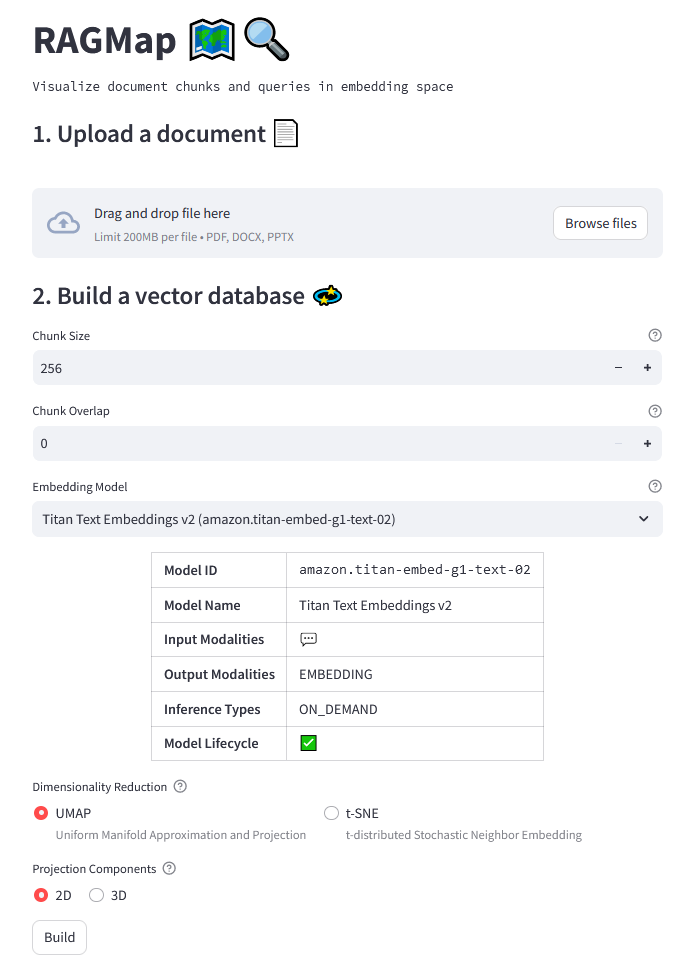
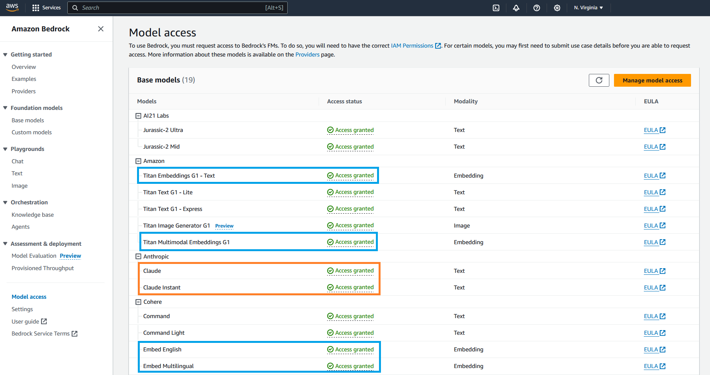
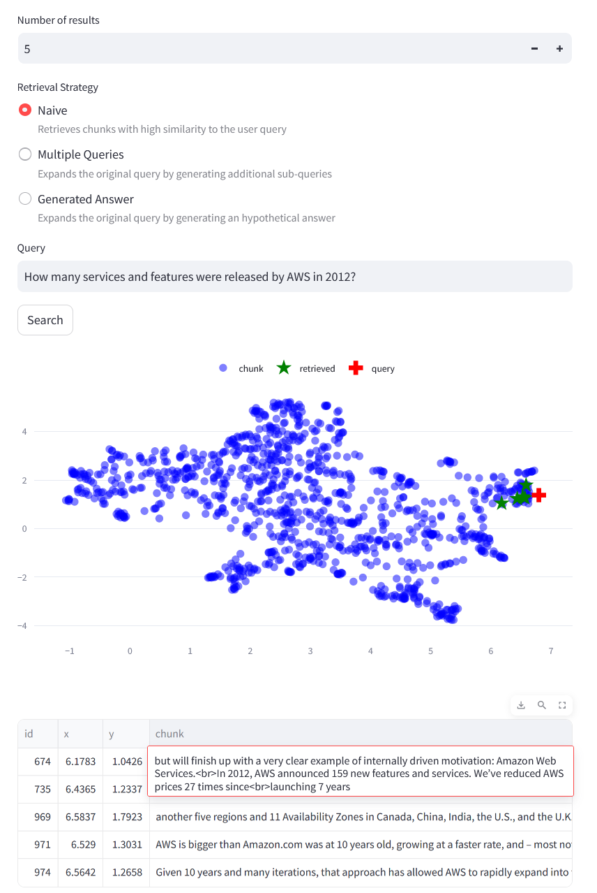

# RAGmap 🗺️🔍

## Overview

A simple Streamlit application powered by [Amazon Bedrock](https://aws.amazon.com/bedrock/) that helps visualize document chunks and queries in embedding space.

> Inspired by DeepLearning.ai's short course on [Advanced Retrieval for AI with Chroma](https://www.deeplearning.ai/short-courses/advanced-retrieval-for-ai/) and Gabriel Chua's award-winning [RAGxplorer](https://github.com/gabrielchua/RAGxplorer).



## Features

* Supports multiple document formats
	- `PDF`
	- `DOCX`
* Supports multiple models via Amazon Bedrock
	- Titan Text Embeddings
	- Titan Multimodal Embeddings
	- Cohere Embed English (*)
	- Cohere Embed Multilingual (*)
* Generates 2D and 3D projection plots
	- UMAP
	- t-SNE (experimental)
* Runs queries using natural language
* Supports advanced retrieval techniques (HyDE, Multi Qns)
* Exports plots as HTML
* Exports query results as CSV

(*) ☝️ **Important notice:** As of January 2024, chromadb's `AmazonBedrockEmbeddingFunction` only works with Titan models. Feel free to upvote this [PR](https://github.com/chroma-core/chroma/pull/1675) to add support for [Cohere Embed models](https://docs.aws.amazon.com/bedrock/latest/userguide/model-parameters-embed.html).

## How to use

### Prerequisites

Enable access to the embedding ([Titan Embeddings](https://docs.aws.amazon.com/bedrock/latest/userguide/titan-embedding-models.html), [Cohere Embed](https://docs.aws.amazon.com/bedrock/latest/userguide/model-parameters-embed.html)) and text ([Anthropic Claude](https://docs.aws.amazon.com/bedrock/latest/userguide/model-parameters-claude.html)) models via Amazon Bedrock.

> For more information on how to request model access, please refer to the [Amazon Bedrock User Guide](https://docs.aws.amazon.com/bedrock/latest/userguide/model-access.html) (**Set up > Model access**)



### Option 1 💻

1. Install dependencies

	```
	pip install -r requirements.txt
	```

2. Run the application

	```
	streamlit run app.py
	```

3. Point your browser to http://localhost:8501

### Option 2 🐳

1. Run the following command to start the service

	```
	docker-compose up
	```

2. Once the container is up and running, head over to http://localhost:8501

## Example: [Amazon shareholder letters](https://medium.com/@austenallred/every-amazon-shareholder-letter-as-downloadable-pdf-4eb2ae886018)



## References

* (AWS) [What is Retrieval-Augmented Generation?](https://aws.amazon.com/what-is/retrieval-augmented-generation/)
* (DeepLearning.ai) [Advanced Retrieval for AI with Chroma](https://www.deeplearning.ai/short-courses/advanced-retrieval-for-ai/)